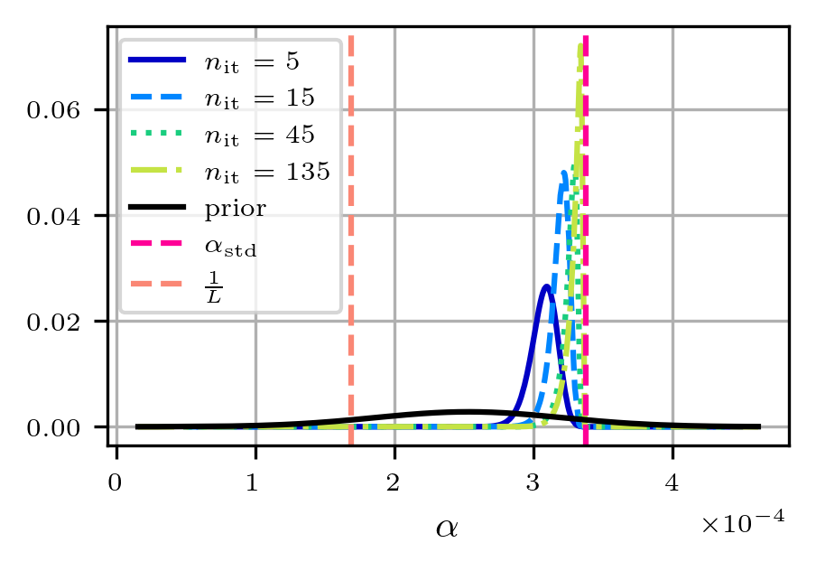
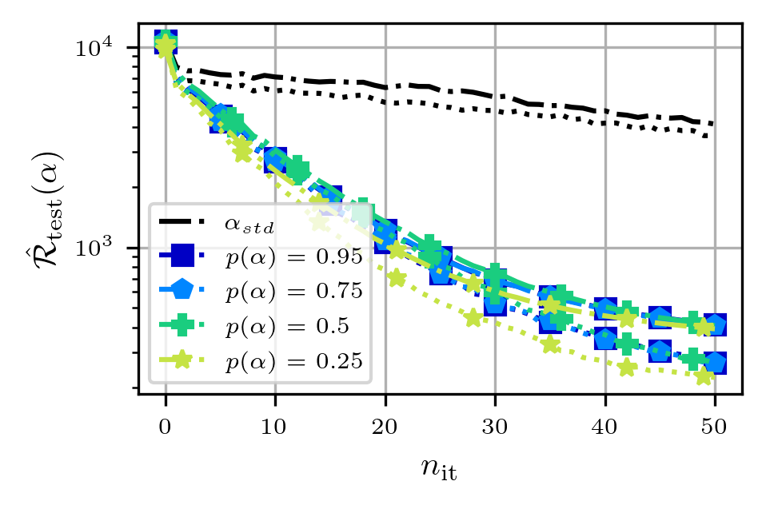
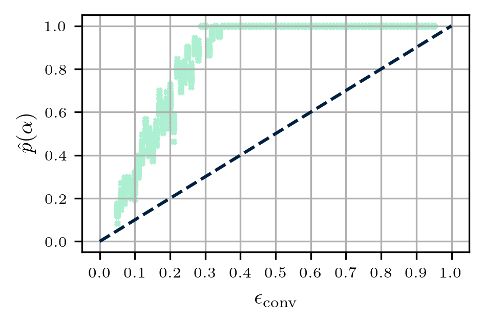
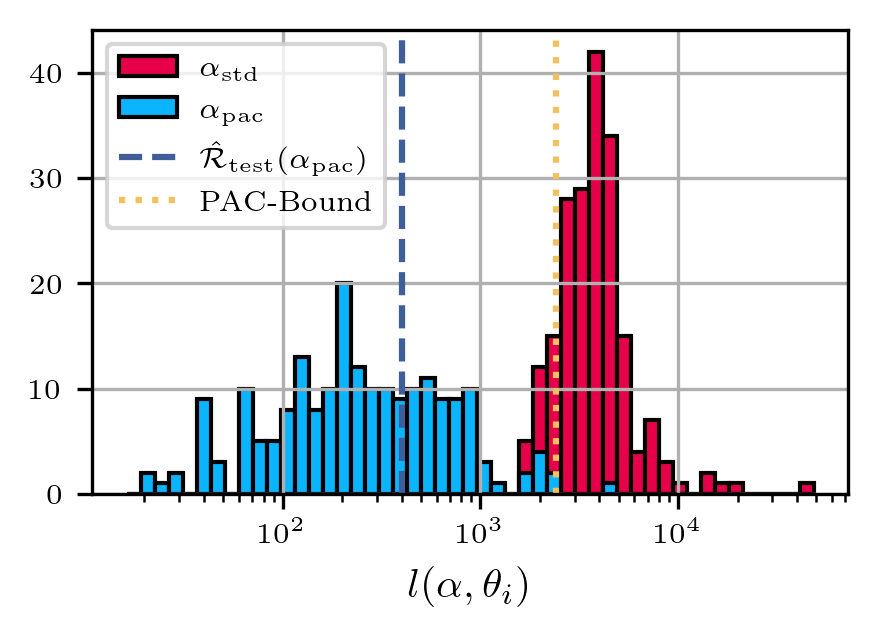

# PAC-Bayesian Learning of Optimization Algorithms
#### by Michael Sucker and Peter Ochs
This repository contains the code to reproduce the experiments of our paper 

["PAC-Bayesian Learning of Optimization Algorithms"](https://proceedings.mlr.press/v206/sucker23a/sucker23a.pdf). 

*Remark*: \
  a) These experiments are a proof-of-concept: This was the first work we published in learning-to-optimize with PAC-Bayesian guarantees. Thus, it contains only small scale experiments on functions that are easily analyzable, and allow for an easy implementation. \
  b) While they are correct here, in the general setting the name "conditioning on convergence" and "convergence probability" are somewhat missleading. Thus, they should be understood in the context of these experiment.

For the paper, we conducted four experiments:

### 1) Convergence of the posterior distribution:
Starting from a simple Gaussian prior, we want to learn the posterior distribution over the step-size parameters of gradient descent on quadratic functions. In this experiment, we study how this posterior evolves when increasing the number of iterations. 

We can see that it behaves in an intuitive manner: For an increasing number of iterations, the posterior seems to contract close to the worst-case optimal step-size $\alpha_{\rm{std}}$.

### 2) Conditioning on convergence:
As second experiment, we investigate how the performance evolves when decreasing the convergence guarantee. Intuitively, one would expect a trade-off: A weaker guarantee should result in stronger performance on less data.

However, we cannot observe the expected behavior in this experiment. While the learned algorithm performs clearly better than the given baseline, all four version perform roughly the same. Since this is not expected, we conduct the third experiment.

### 3) Empirical convergence probability
We investigate how the enforced convergence probability compares to the empirically attained convergence probability. Here, we want to figure out whether \
  a) the imposed lower bound is satisfied on the test-data, that is, whether our theoretical construction works as intended, \
  b) the imposed lower bound is also tight. 
  
For this experiment, for each imposed lower bound (dashed diagonal) we estimate the empirical convergence probability on 25 independent data sets. 

We can observe from the plot that a) is indeed true: The lower bound is satisfied in all of the test cases. However, b) is not true: The lower bound is not tight, which (at least in part) explains the behavior that was observed in experiment 2).

### 4) Loss-histogram and PAC-Bayesian bound
We investiage how the learned algorithm compares to the standard baseline, that is, whether the learning approach can provide a sufficient acceleration, and whether the predicted guarantee (in form of the PAC-Bayesian upper bound) empirically holds true.

The results for the learned algorithm are shown in blue, and the corresponding ones for the baseline algorithm in red. The predicted PAC-bound is shown as dotted yellow line. 
We can see that, even in this simple setting, learning the hyperparameters with our proposed method already accelerates the algorithm (roughly one order of magnitude). Furthermore, we can see that the PAC-Bayesian upper bound yields a reasonable estimate for the true mean performance (dashed line).
